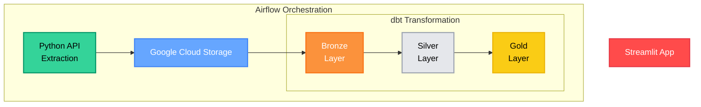

# stockpilot-investment-analysis-app
Turning near real-time market data into simple, actionable investment decisions by automating ingestion, cleaning, feature engineering, and visualization through a modern data-engineering stack.

## Architecture Overview

